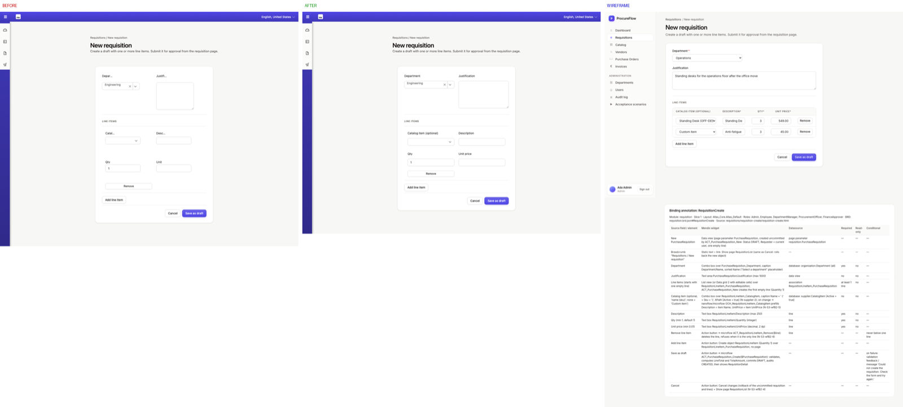
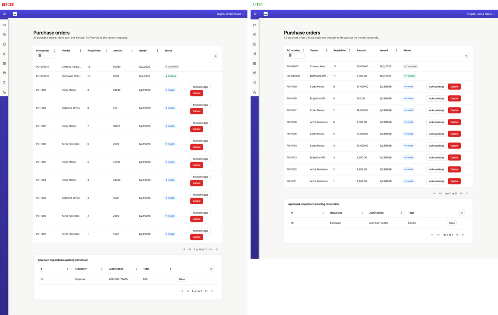

# Defects on every page from the first page build (nav shell, form labels, grid rows) reach DONE: no instrument renders one page next to its rendered wireframe early

**From:** field run, requirements-driven app replacement (unattended build of a 137-row plan, 7 modules). Same run as #189 and #190.
**Date:** 2026-10-02
**Kind:** bug
**Field evidence:** 44 of 44 reviewed pages carry the wrong nav shell, and 8 pages have truncated form labels. Every instrument that ran during the build was green or high: text-match fidelity was 37/42 pages ≥85%, and `check-page-shell.sh` was silent. The defects were first seen at the module-review LOOK, run after DONE had been declared. The proof images sit next to this file.
**Proposed target:** `skills/walking-skeleton.md`, `skills/ui-loop.md`, `bin/lib/obligations.tsv` + `bin/gate-check.sh` (Stage 5), `skills/brd-to-build-plan.md` (closing rows)

---

**Severity:** High. These defects are uniform: they are on page 1 and on page 44 alike. One side-by-side look at the first built page would have shown them on day one. Instead they cost 44 pages of rework, found after DONE.
**Toolkit:** frozen at `192b69a`. Every file quoted below has the same content on master `8abd614`. Between the two commits only `bin/gate-check.sh`'s stage-5 reading list and two `iterative-build-loop.md` checklist lines changed.
**mxcli version:** v0.24.0 · **Mendix version:** 11.14.0
**Classification:** **a rule that no gate enforces, and the rule is too vague to catch a shell defect.** Details below.

## What was wrong on every page (LOOK report, `design/ui-reviews/ui-review-2026-10-02.html`)

Header (verbatim): `All modules · 44 of 46 pages reviewed` and `Verdicts over 44 reviewed pages: P1 4 · P2 25 · P3 10 · pass 5. Yardstick: rendered wireframe side by side (41 pages)`.

| # | Sev | Finding (verbatim, abridged) | Pages |
|---|---|---|---|
| S1 | P2 | "Navigation shell differs from the wireframes on every page: app has a dark-blue icon-only sidebar and a top bar with the stock 'mx' logo and language selector; wireframes have a light text sidebar with the [app] brand and a user block (avatar + Sign out)." | all 44 |
| S2 | P1 | "Row-action buttons stack vertically in datagrid action columns, doubling row height; on Invoice_Overview they are clipped at the right edge ('Ope')." | 4 |
| S3 | P2 | "Amounts unformatted (50000, 1899, 429.5) where the wireframe shows grouped two-decimal currency." | 3 |
| S4 | P1 | "Form labels truncated/clipped ('Depar…', 'Temperat…', 'Price' for 'Price variance tolerance')…" | 8 |
| S6 | P2 | "Line-checks grid headers truncated to single letters ('L. P. PO. Inv. Var.')." | 6 |

The wireframe rail is `--ds-rail-w: 248px` (`design/ds.css:330`). It is light, with the brand on top, labelled items and a user chip.

**S4 root cause.** Mendix input widgets render their own `.form-group` with Atlas horizontal columns. The label is `col-sm-3`, so its max-width is 25% and long text is cut with an ellipsis. This happens inside the ported design-system `.form-grid`. The fix is a 4-line bridge rule in the theme `main.scss`, marked `[MENDIX BRIDGE] … (LOOK S4, 2026-10-02)`. The fix for S1 is the same kind of thing: an `APP SHELL [MENDIX BRIDGE]` block that keeps Atlas_Default's sidebar expanded, hides `.region-topbar` and paints the brand on the sidebar. Neither problem is about any one page. Both belong to the theme and the layout, so both were visible on the very first page.

*New-requisition form. Panels left to right: BEFORE (as built), AFTER (LOOK fixes, before the S1 bridge), WIREFRAME (rendered), all at 1440×900. The shell (S1) is still the Atlas one in AFTER because the S1 bridge came later. Labels read `Depar…`, `Justifi…`, `Catal…` before the fix.*

*Purchase-order overview. BEFORE: Acknowledge and Cancel stack in every row, which doubles the row height (S2), and amounts read `50000`, `24000` (S3). AFTER: autoFit action column plus grouped two-decimal format.*

## What ran green over it

| Instrument | What it reported | Why it cannot see this |
|---|---|---|
| `page-fidelity.js` | `37/42 pages of record ≥85%, mean 87.7%` (FINAL-REPORT; per-page in `docs/progress/ui-fidelity/final.txt`, rows in `docs/PAGE-FIDELITY.tsv`) | It matches text identifiers in the MDL against the wireframe and renders nothing. `ui-preflight-pages.md:275` already says it "closes nothing". |
| `check-page-shell.sh` | no violation | Its layout-shell rule only fires `if grep -qE '<nav[^>]*class="[^"]*tabs' "$wf"` (`project-bin/check-page-shell.sh:302`), i.e. when the wireframe draws a top bar. These wireframes draw a side rail (`.app-rail`), so any non-popup layout passes. Atlas_Default's collapsed dark rail plus top bar passes as a "sidebar". It reads MDL and never sees the rendered chrome. |
| `check-design-reaches-app.sh` | never run (`design-reaches-app 0/1`), which is itself part of the finding | Even when it runs, it counts tokens, knobs and classes in the built CSS. Tokens can arrive while the shell stays Atlas's. |
| `design-audit.js` (run after DONE) | instrument verdict `pass`. Summary: `"wireframeMatched": 0, "wireframeUnmatched": 46` | It made no wireframe comparison at all, so "pass" says nothing about conformance. |

## When it was caught

Only at the module-review LOOK on 2026-10-02. That was after `docs/progress/FINAL-REPORT.md` had declared `DONE 2026-10-01 17:15 UTC`. Its closing section reads: "The Stage 5 gate was not run before DONE was declared. Run afterwards, it reports the module-close obligations all open: **look 0/7, sweep 0/7, journeys 0/7, coherence 0/1, walking skeleton 0/1, design-reaches-app 0/1**".

## Existing rules, and why none of them fired

1. **`skills/walking-skeleton.md` comes closest.** Row 6 (line 38) asks for "One screenshot of the page, kept | `docs/looks/00-skeleton.png`, judged with the four `ui-loop.md` questions". Completion item 5 (line 51) says "The screenshot exists and the four `ui-loop.md` answers are written under it." The skill's own field run even records this exact S4 defect: "the form rendered horizontal with truncated labels — the first thing the first module fixes, known on day one" (line 70). So the rule exists, but:
   - **Nothing enforces it.** The `skeleton` row (`bin/lib/obligations.tsv:51`) only reports PENDING. The gate output for this run says `Stage 5 (Build): MANUAL` and `Obligations: 9 pending … These do not affect the exit code and never have` (`bin/gate-check.sh:2670`). This run never did the skeleton: no `docs/skeleton-proof.md`, no `docs/looks/`. Nothing stopped page 2 from being built.
   - **It does not ask for the comparison that catches a shell defect.** The four questions are deliberately unprimed (`ui-loop.md`, "Deliberately unprimed"), and step 3 says "against the page's wireframe" (`ui-loop.md:51`). Nothing requires the wireframe to be *rendered* at the same viewport and set beside the capture. Nothing names the chrome either (rail, top bar, brand, user block). A reviewer looking at one app screenshot sees a plausible Atlas app.
2. **`skills/ui-loop.md` describes itself as producing no artifact.** Line 11–12: "One page, one screenshot, four questions, no report." With nothing written down, no gate can check that it happened.
3. **`ui-loop.md:104-105` steers away from shell defects:** "The tell is *uniformity* — a defect on 7 of 7 screens at exactly one width is the harness until proven otherwise". A shell defect is uniform by nature.
4. **`ui-preflight-pages.md:287-288` already names the gap:** "A shell defect is uniform across every page built the same way, so no page stands out as a diff and per-page review does not surface it — which is exactly what a mechanical check is for". The only mechanical check, `check-page-shell.sh`, compares MDL layout names and, for side-rail wireframes, compares nothing (row 2 of the table above).

**Open PRs that overlap but do not cover this.** #193 makes Stage 5 FAIL while a built page has no screenshot opened since its build. That pushes the look earlier, but it gates the *Stage 5 done* claim, not page 2. An opened app screenshot also counts as seen even when no wireframe was beside it. #191 relabels fidelity as "not a LOOK". This finding is still open on master `8abd614`.

The build session shares the blame. It never ran the walking skeleton, and it never opened `ui-loop.md`/`module-review.md` (see #189). But the skeleton exists to catch theme and layout-level defects on day one, and nothing makes its look either comparative or blocking.

## Proposed fix (short)

1. **First-page shell verdict, at the walking skeleton.** Do this the first time a page is built in a project, or after any layout or theme port.
   - Capture **one** page as a real user role, plus its wireframe rendered from `file://`, at the same viewport (1440×900 here), from a fresh browser context. Compose them side by side.
   - Write `docs/looks/00-shell-verdict.md`, one line per item, each PASS/FAIL with a note:
     - **shell**: rail width and colour, top bar present or absent, brand, user block, labelled versus icon-only items;
     - **form label layout**: on top or beside, truncation;
     - **grid**: row height, action buttons on one line, header captions;
     - **number formatting**: grouping and decimals.
   - Embed or link the composite PNG in the file.
2. **Make it blocking before page 2.**
   - Add an obligation row `shell-look  mdl  project  path  docs/looks/00-shell-verdict.md  yes  no  5  skills/walking-skeleton.md`.
   - Have `gate-check.sh <project> 5` FAIL page work while that file is missing or has an unaddressed FAIL. This is the same mechanism #192/#193 use, just keyed to the first page instead of to Stage-5 done.
   - `exec.sh` can warn when a second page script runs with the verdict missing (warn, not refuse, per #193's "never block the remedy").
3. **Put it in the plan.** `brd-to-build-plan.md` closing rows: the skeleton phase ends with a `PROVE shell verdict (docs/looks/00-shell-verdict.md)` row, and Stage 4 (#192) counts it.
4. **Exempt the shell from the uniformity heuristic.** Add one line to `ui-loop.md`: uniformity points to the harness only for responsive or viewport findings; a uniform *chrome* difference from the wireframe is the expected shape of a theme or layout defect.
5. **`check-page-shell.sh`.** For a side-rail wireframe (`.app-rail`), stop passing silently. Print `shell: not MDL-checkable for side-rail wireframes — see 00-shell-verdict.md`, so the gap is named rather than read as green.

**Workaround today:** after the skeleton's first page, run the visual-check capture: app as the wireframe's role plus the rendered wireframe, 1440×900, full page. Look at the pair before writing page 2. In this run that capture tool existed (`tests/e2e/visual-check-shots.js`) and was first used after DONE: `taken 38/43 wireframed pages`.
