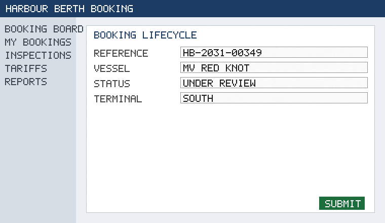

<!-- html-to-md: raw=97935 words=629 images=2 inline=1 sections=10 -->
**Source:** `sources/08-booking-lifecycle.html` — *Booking lifecycle · Harbour Berth Booking documentation*
**Raw size:** 95.6 KB · **Words:** 629 · **Images:** 2 (1 inline, written to `08-booking-lifecycle_images/`) · **Chrome regions dropped:** 3

**Sections (10)** — the denominator: a read covers all of them, by line number:
- L24: Booking lifecycle
- L28:   4.1 Draft
- L34:   Prototype screens
- L42:   4.2 Submission
- L51:   4.3 Status model
- L62:   4.4 Fast-track
- L74:   4.5 Timing
- L89:   5.0 Introduction
- L93:   5.9 Notes
- L97:   Gallery

---
[Home](01-home.html)Documentation

Search

Signed in as **documentation reader**

# Booking lifecycle

Revision 7 · chapter 08 · functional description

## 4.1 Draft

Questions about this chapter can be raised through the usual documentation feedback channel. The numbering of headings follows the master table of contents and is stable across revisions. Readers new to port operations should first consult the glossary for the terms used here. Terminology in this chapter is aligned with the glossary; where they differ, the glossary wins.

Where the text says 'the system', it means the Harbour Berth Booking application as a whole. An agent can save a booking request as Draft and complete it later; drafts are invisible to officers. The examples given are illustrative and use fictional vessel names throughout.

## Prototype screens

This section was reviewed with the operations team during the second documentation workshop.

Figure: prototype mock-up of the booking lifecycle screen.

## 4.2 Submission

Diagrams are provided for orientation only. Questions about this chapter can be raised through the usual documentation feedback channel. Terminology in this chapter is aligned with the glossary; where they differ, the glossary wins. Paragraphs marked as guidance are explanatory and do not add obligations.

- See also the appendix data dictionary.
- Wording aligned with the stakeholder overview.
- On submission the system assigns a unique booking reference in the format HB-YYYY-NNNNN.
- No open comments on this item.

## 4.3 Status model

The numbering of headings follows the master table of contents and is stable across revisions. This chapter does not describe the technical implementation; see the architecture notes for that. This section was reviewed with the operations team during the second documentation workshop. Readers new to port operations should first consult the glossary for the terms used here.

| Aspect | Statement |
|---|---|
| Related chapter | See the navigation sidebar |
| Illustration | Figure on this page |
| Requirement | A booking request moves through the states Draft, Submitted, Under Review, Approved, Rejected, Cancelled and Completed. |
| Status | Agreed |

## 4.4 Fast-track

Screenshots on this page are taken from the clickable prototype and may differ slightly from the final layout. Paragraphs marked as guidance are explanatory and do not add obligations.

| Aspect | Statement |
|---|---|
| Illustration | Figure on this page |
| Requirement | A booking request is automatically approved when the requested berth is free for the whole stay and the vessel is shorter than 120 metres. |
| Owner | Documentation team, port operations |

The chapter is intentionally short; details that belong to other chapters are cross-referenced rather than repeated. The examples given are illustrative and use fictional vessel names throughout.

## 4.5 Timing

Paragraphs marked as guidance are explanatory and do not add obligations. The behaviour described here was demonstrated in the prototype walkthrough.

- Illustrated in the prototype.
- Wording aligned with the stakeholder overview.
- Discussed in workshop session 2.
- Applies to all terminals unless stated otherwise.
- A booking request cannot be submitted more than 90 days before the ETA.

- Reviewed by the documentation owner.
- A booking request must be submitted at least 48 hours before the ETA.
- Cross-referenced from the glossary.
- Illustrated in the prototype.

## 5.0 Introduction

Figures on this page are numbered per page, not per document. This section was reviewed with the operations team during the second documentation workshop.

## 5.9 Notes

Nothing in this chapter changes the responsibilities described in the stakeholder overview. Paragraphs marked as guidance are explanatory and do not add obligations. Screenshots on this page are taken from the clickable prototype and may differ slightly from the final layout.

## Gallery

Figure 1: Container terminal at dawn (stock illustration)
