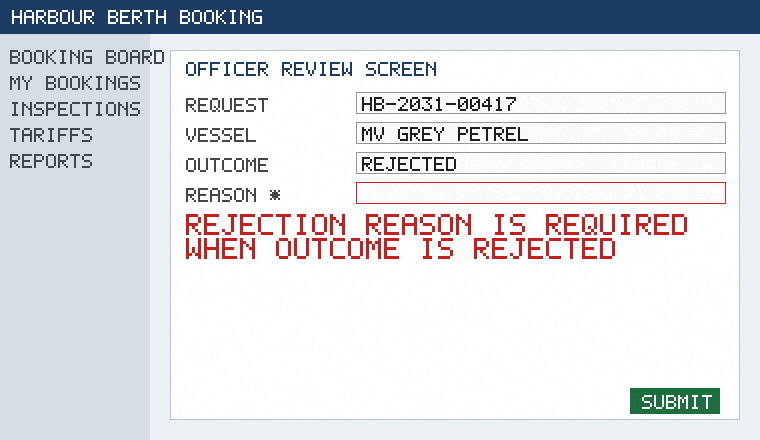

<!-- html-to-md: raw=106805 words=358 images=3 inline=1 sections=6 -->
**Source:** `sources/21-officer-review-screen.html` — *Officer review screen · Harbour Berth Booking documentation*
**Raw size:** 104.3 KB · **Words:** 358 · **Images:** 3 (1 inline, written to `21-officer-review-screen_images/`) · **Chrome regions dropped:** 3

**Sections (6)** — the denominator: a read covers all of them, by line number:
- L20: Officer review screen
- L24:   17.1 Review screen
- L32:   Prototype screens
- L40:   18.0 Introduction
- L50:   18.9 Notes
- L56:   Gallery

---
[Home](01-home.html)Documentation

Search

Signed in as **documentation reader**

# Officer review screen

Revision 7 · chapter 21 · functional description

## 17.1 Review screen

This chapter does not describe the technical implementation; see the architecture notes for that. The behaviour described here was demonstrated in the prototype walkthrough. Readers new to port operations should first consult the glossary for the terms used here. Questions about this chapter can be raised through the usual documentation feedback channel.

Questions about this chapter can be raised through the usual documentation feedback channel. Readers new to port operations should first consult the glossary for the terms used here. The review screen shows the vessel's dimensions next to the berth's limits and highlights any exceedance in red. Figures on this page are numbered per page, not per document.

For the history of this chapter see the release notes page. Where the text says 'the system', it means the Harbour Berth Booking application as a whole.

## Prototype screens

The numbering of headings follows the master table of contents and is stable across revisions.

Figure: the decision panel of the officer review screen (prototype).

## 18.0 Introduction

Questions about this chapter can be raised through the usual documentation feedback channel. The examples given are illustrative and use fictional vessel names throughout. This section was reviewed with the operations team during the second documentation workshop. Nothing in this chapter changes the responsibilities described in the stakeholder overview.

The behaviour described here was demonstrated in the prototype walkthrough. Diagrams are provided for orientation only.

Figure 1: Container terminal at dawn (stock illustration)

## 18.9 Notes

This chapter does not describe the technical implementation; see the architecture notes for that. The examples given are illustrative and use fictional vessel names throughout. Screenshots on this page are taken from the clickable prototype and may differ slightly from the final layout. Figures on this page are numbered per page, not per document.

Terminology in this chapter is aligned with the glossary; where they differ, the glossary wins. Diagrams are provided for orientation only.

## Gallery

Figure 2: Quay wall and mooring bollards
