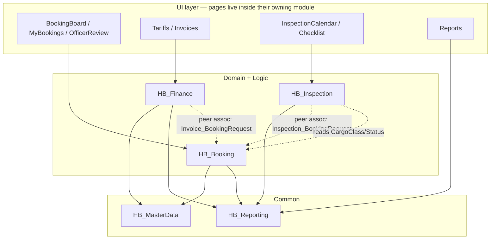
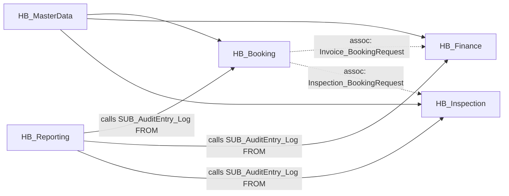
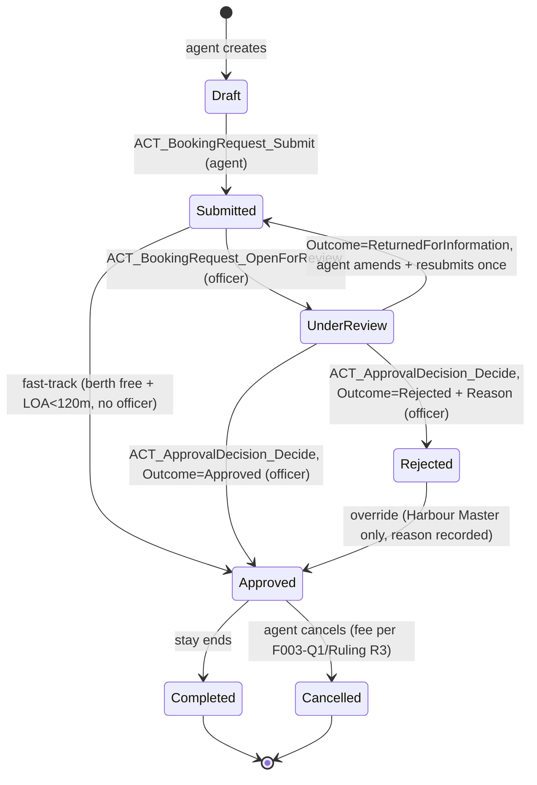
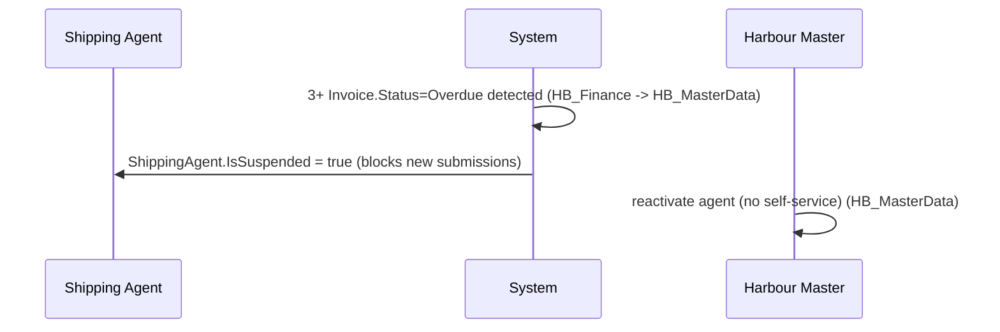

# Architecture Blueprint — Harbour Berth Booking

Generated by hand (architect-agent role, unattended run `final-harbour-c`) per
`skills/architecture-blueprint.md`. This markdown is the source of truth; `blueprint.html` is
its generated render — never hand-edited.

Single Mendix app (Stage 0 Architecture Scale Flag: **No concern** — see `triage.md`). Five
modules (see `modularize-domain.md` sign-off in `module-design.html` / `PROJECT.md`):
`HB_MasterData`, `HB_Booking`, `HB_Finance`, `HB_Inspection`, `HB_Reporting`.

## Module summary

| Module | Layer | Entities | Definition |
|---|---|---|---|
| HB_MasterData | Common | Vessel, ShippingAgent, Terminal, Berth | `modules/HB_MasterData/definition.md` |
| HB_Booking | Domain+Logic | BookingRequest, ApprovalDecision | `modules/HB_Booking/definition.md` |
| HB_Finance | Domain+Logic | Tariff, Invoice | `modules/HB_Finance/definition.md` |
| HB_Inspection | Domain+Logic | Inspection, InspectionItem | `modules/HB_Inspection/definition.md` |
| HB_Reporting | Common | AuditEntry | `modules/HB_Reporting/definition.md` |

## Step 2 — Layer (architecture) diagram



No arrow points up the tiers. `HB_Reporting`'s `AuditEntry` deliberately owns **no** association
into any feature module (see `modules/HB_Reporting/definition.md` — architecture decision
F007-Q1) — that is what keeps it a true Common module.

## Step 3 — Wiring / dependency diagram (build order)



Build order falls out directly: **HB_MasterData and HB_Reporting first** (no incoming
dependency), **then HB_Booking**, **then HB_Finance and HB_Inspection** (both depend on
HB_Booking's BookingRequest existing) — matching the slice ordering already recommended in
`triage.md` Stage 0.

## Step 3b — Workflow diagram (state view): BookingRequest lifecycle

CAC-3 Q3 equivalent (unattended): the BookingRequest.Status enum drives role-gated transitions
(agent submits, officer reviews, harbour master overrides) — this is workflow-shaped per
`architecture-blueprint.md` Step 3b, option B (enum + microflows, not a native Mendix Workflow —
no chapter describes a multi-step human task/BPMN-style flow, just direct status transitions).



No boundary events, event sub-processes or parallel splits — every source chapter describes a
single linear per-request transition, never a multi-branch process spanning wall-clock time
beyond ETA/ETD. Targeting mechanism per role-gated transition: role XPath on the microflow's
calling page (Berth Officer for review/decide, Harbour Master for override) — quoted from
ch16 §12.3 ("Only the Harbour Master may override a Rejected decision").

## Step 3c — Agent-wiring diagram

**N/A.** No chapter, workshop note, or screenshot describes an AI/LLM/agent call site anywhere
in the corpus.

## Step 3d — Cross-persona journeys

Four personas (Shipping Agent, Berth Officer, Harbour Master, Inspector) — multi-persona, so
this section is produced, not skipped.

### J-01 — Booking submission through departure and invoicing

```mermaid
sequenceDiagram
  participant Agt as Shipping Agent
  participant Off as Berth Officer
  participant Ins as Inspector
  participant HM as Harbour Master
  Agt->>Agt: create Draft, submit (HB_Booking)
  Off->>Off: open for review, decide (HB_Booking)
  Off-->>Agt: Approved / Rejected / Returned for Information
  HM->>HM: override a Rejected decision (HB_Booking)
  Ins->>Ins: schedule + complete inspection (HB_Inspection) -- required first if Dangerous Goods
  Off->>Off: grant departure clearance once all inspections Passed/Deferred (HB_Inspection)
  Agt->>Agt: booking marked Completed
  HM->>HM: invoice auto-generated, later marked Paid/Void (HB_Finance)
```

### J-02 — Suspension and reactivation



| Journey id | Name | Personas involved | Modules touched |
|---|---|---|---|
| J-01 | Draft → Review → Approve/Override → Inspect → Clear → Invoice | Shipping Agent, Berth Officer, Inspector, Harbour Master | HB_Booking, HB_Inspection, HB_Finance |
| J-02 | Auto-suspend → Harbour-Master reactivation | Shipping Agent, Harbour Master | HB_Finance, HB_MasterData |

## Step 4 — Fit-gap

See `architecture/fit-gap.md`. One "Buy" row (inspection-calendar drag-drop widget), everything
else Native/Config/Build.

## Step 5 — Dependencies & open issues → PROJECT.md

Carried into `PROJECT.md`'s Decisions/Open-questions tables, not duplicated here:
unresolved BRD `openQuestions` (F002-Q1, F003-Q2/Q3, F004-Q2, F007-Q1 — F003-Q1/F005-Q1 already
resolved by Ruling R3), the one marketplace "Buy" (inspection calendar widget, to confirm at
Stage 4 Step 0), and the AIS-feed stub (no protocol/auth/failure-mode documented).

## Step 6 — The three decisions the source can't answer

Recorded `CONFIRMED` in `PROJECT.md` (unattended run — see Rulings ledger for the reasoning
behind each; a ✋ gate needs `CONFIRMED`, not `ASSUMED`, so each is recorded as a confirmed
default position taken in the absence of a human, with its cost-if-wrong stated):

- **6a Security/role model:** the 4 documented roles map 1:1 onto Mendix user roles, no
  collapsing/splitting; no anonymous/guest access anywhere (every page requires sign-in per
  ch05); no additional PII/regulatory segregation beyond the existing company-row-security.
- **6b Data volumes/NFRs:** no numbers exist in the source (sufficiency `nfr` = named); assumed
  small-to-medium port-authority scale (tens to low hundreds of concurrent bookings, single-digit
  concurrent users per role) — Data Grid 2 + standard pagination, no special indexing/batch
  design needed at this scale. Flagged for real numbers before a production sizing decision.
- **6c Integration contracts:** AIS feed built as a stub (poll-and-flag behaviour only, per
  ch33) — real endpoint/auth/failure-mode has no source at all; Stage 4/5 wires the stub first.

## Architecture review (Step 7b, one pass — unattended)

Single-pass review since no human is available to iterate with (unattended run). Findings below
were self-checked mechanically (association targets, layer directions) and by re-reading each
module's Dependencies block:

- [x] Single vs multi-app: one app (Stage 0 flag, no concern) — CONFIRMED
- [x] Every association's target entity exists and is defined exactly once (Stage 2 validation, re-checked here) — 0 dangling targets
- [x] No arrow points up the tiers (HB_Reporting/HB_MasterData own no association into a feature module) — confirmed by inspection of all 5 definition.md Dependencies blocks
- [x] Every many-to-many (`Vessel_ShippingAgent`) has no junction entity needed — Mendix native M:N, no extra attributes on the relationship itself per the source
- [x] Cross-module associations (`Invoice_BookingRequest`, `Inspection_BookingRequest`) — ownership assigned (Invoice, Inspection own them respectively)
- [x] Fit-gap "Buy" row (calendar widget) — justified (no native drag-drop calendar); "Gap"/"Workaround" rows (AIS feed) — genuinely deferred to a stub, not resolvable from this source
- [x] Cross-persona journeys drawn (J-01, J-02) — multi-persona app, not skipped

No P1 findings. Recorded `CONFIRMED` in `PROJECT.md` before Stage 4 work begins.
