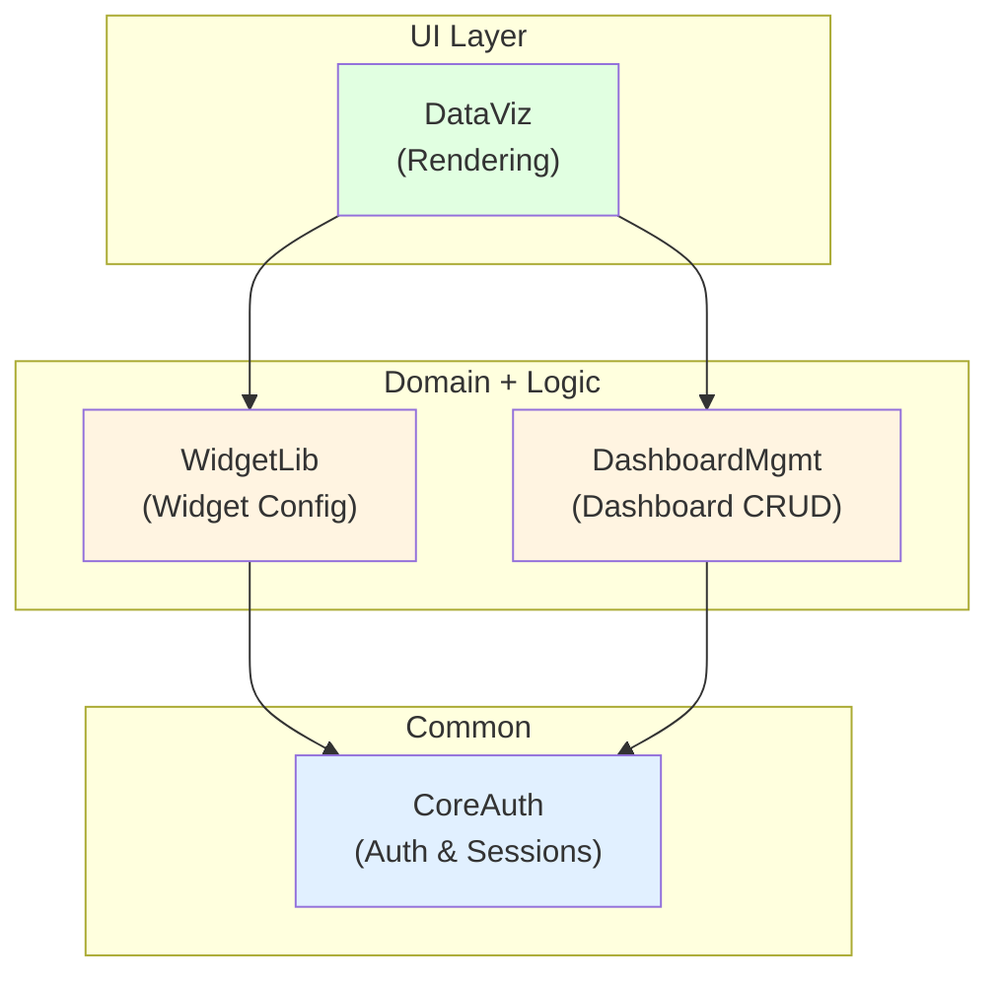
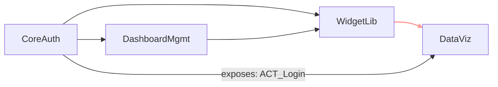

# Architecture Blueprint — Puffin Dashboard Publisher

**Version:** 1.0  
**Date:** 2026-09-12  
**Status:** Ready for build plan

---

## Overview

Puffin migrates from Node/Express/React to Mendix as four tightly integrated modules across three layers: a Common authentication foundation, two domain-logic modules (Dashboard and Widget management), and a UI-focused data visualization layer.

**Build order:** CoreAuth → DashboardMgmt → WidgetLib → DataViz  
**Dependency graph:** Linear; no circular dependencies

---

## Module Structure

### Module Definitions

Each module is documented in its own `modules/<ModuleName>/definition.md`:

- **[CoreAuth](modules/CoreAuth/definition.md)** — Authentication, sessions, user roles (Common layer)
- **[DashboardMgmt](modules/DashboardMgmt/definition.md)** — Dashboard CRUD, ownership, state machine (Domain layer)
- **[WidgetLib](modules/WidgetLib/definition.md)** — Widget instances, data source configuration (Domain layer)
- **[DataViz](modules/DataViz/definition.md)** — Chart/table/metric rendering, query execution (UI layer)

---

## Architecture Layers

**Layer rules:**
- UI imports Domain + Logic; Domain imports Common; Common imports nothing
- No cross-module associations except as explicitly wired in the dependency graph
- Common (CoreAuth) is never modified after initial build

---

## Wiring & Dependency Graph

**Build order (topological sort):**
1. **CoreAuth** — no dependencies
2. **DashboardMgmt** — depends on CoreAuth only
3. **WidgetLib** — depends on CoreAuth, DashboardMgmt
4. **DataViz** — depends on WidgetLib, DashboardMgmt, CoreAuth

**Critical path:** CoreAuth → DashboardMgmt → WidgetLib → DataViz (4 sequential modules)

---

## Fit-Gap Analysis

| Source Capability | Mendix Approach | Classification | Notes |
|-------------------|-----------------|-----------------|-------|
| User login/session | Native JWT + Mendix sessions | **Ready** | Standard auth pattern; bcrypt hashing; 24-hour token expiry |
| Dashboard CRUD | Domain entity + microflows | **Ready** | State machine (Draft→Published→Archived) via status enum |
| Dashboard ownership | Foreign key (Dashboard.OwnerId→User) | **Ready** | Standard ownership pattern |
| Widget picker UI | Pages + popup grid | **Ready** | Reusable widget catalog; category filtering via search |
| Widget configuration | JSON config field + form panel | **Extract-only** | Configuration persistence needs validation on load |
| Chart rendering | Atlas Charts or charting library | **Manual** | Chart library selection & styling pending designer review (Stage 3b) |
| Table rendering | Mendix DataGrid2 or custom grid | **Ready** | Native pagination; sorting via data source sorting |
| Metric display | Label + conditional styling for trend | **Ready** | Sparkline deferral OK for POC (future enhancement) |
| Data query execution | Prepared SQL + parameter binding | **Extract-only** | Requires data source abstraction & query template system |
| Query result caching | Mendix session variable or custom table | **Defer** | Not required for POC; defer to Phase 2 optimization |
| Real-time updates | Polling at intervals (configurable) | **Extract-only** | WebSocket/Server-Sent Events deferred; polling acceptable for POC |
| Concurrent edit prevention | Optimistic locking (version field) | **Manual** | Simple "last edit wins" acceptable for POC; warn on conflict |
| Role-based access | Mendix role gates + field read-only | **Ready** | Creator/Viewer roles sufficient; fine-grained ACL deferred |

**Summary:** 7 Ready, 4 Extract-only (minor validation/config), 2 Manual (design-dependent), 1 Defer (nice-to-have)

---

## Known Gaps & Open Questions

1. **Chart rendering library choice** (F104 → DataViz)
   - Mendix Atlas Charts, Highcharts, or Chart.js?
   - **Impact:** Determines widget rendering performance and styling
   - **Owner:** Architect (Stage 3b designer review)
   - **Blocks:** Stage 4 build plan step 2 (framework decisions)

2. **Widget configuration persistence** (F103 → WidgetLib)
   - Configuration stored as JSON string or structured entity?
   - **Impact:** Flexibility vs. queryability tradeoff
   - **Owner:** Architect
   - **Blocks:** None (JSON is viable, structured entity is optimization)

3. **Real-time updates scope** (F104 → DataViz)
   - Polling only, or WebSocket/SSE support?
   - **Impact:** User experience vs. backend load
   - **Owner:** Requirements (POC: polling; Phase 2: real-time)
   - **Blocks:** Build plan priority (Core: polling; Nice-to-have: real-time)

4. **Data source security** (F103 → WidgetLib)
   - Embedded credentials vs. separate credential management?
   - **Impact:** Multi-tenant safety
   - **Owner:** Architect (security review Stage 3b)
   - **Blocks:** Data source entity schema (Step 1)

---

## Mendix-Specific Constraints

- **Mendix version:** Target Studio Pro 10.x+ (to be confirmed in Stage 4)
- **Licensing:** App Store modules (Atlas Charts) availability
- **Performance:** Grid rendering for 10k rows requires lazy loading (acceptable)
- **Security:** No automatic SQL injection prevention; parameterized queries mandatory
- **Scalability:** Session-variable widget cache suitable for <100 concurrent users

---

## Next Steps

**Stage 3b (Design Artifacts — parallel track):**
- Design system & theme (color palette, typography)
- Page wireframes (DashboardEditor, WidgetPicker, ChartWidget)
- Chart styling & widget template library

**Stage 4 (Build Plan):**
- Module brief for each module (ownership, sprint assignment)
- Detailed dependency list from wiring graph
- Build-order validation against known gaps
- Open-question resolution tracker

**Stage 5 (Build):**
- Start with CoreAuth (foundation); parallel workstreams on DashboardMgmt/WidgetLib possible after auth layer is stable
- DataViz waits for WidgetLib; chart rendering library confirmed in Stage 3b designer review
