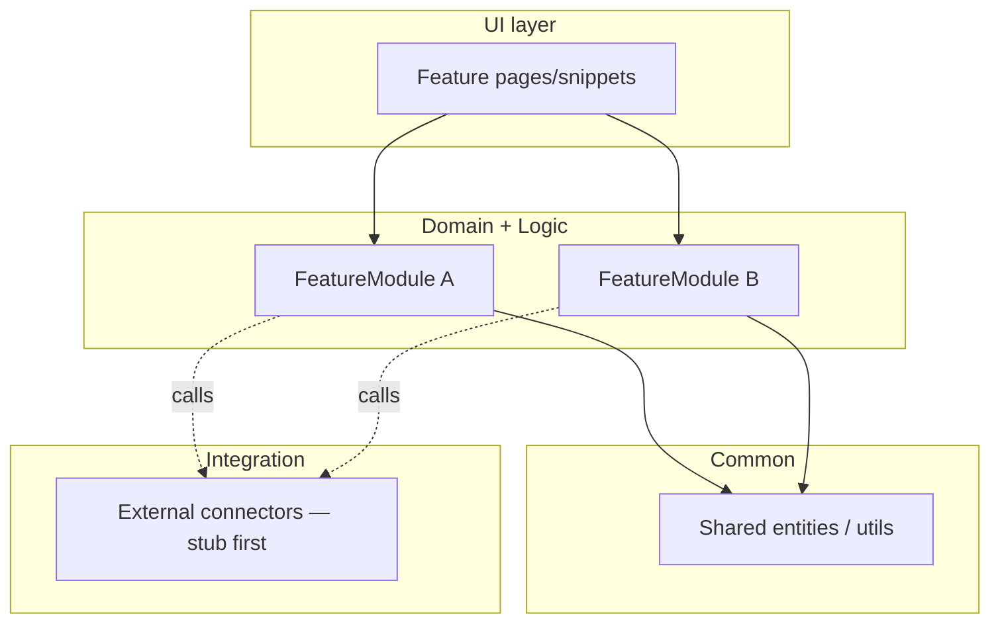
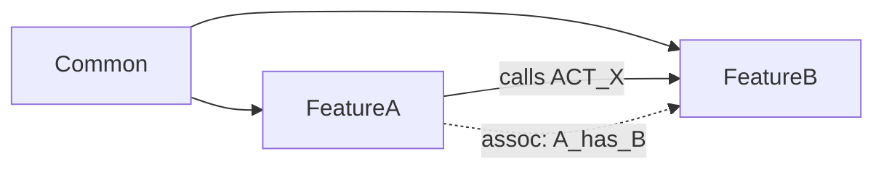

# Architecture Blueprint — Diagrams, Module Definitions, Wiring & Fit-Gap
**Applies to:** migration or requirements-driven build (works from documents/SME input — no legacy source needed).
**Purpose:** Turn Mendix-rearchitected BRDs into a readable target-architecture blueprint — module definition docs, an architecture diagram, a wiring/dependency graph, and a fit-gap analysis — so dependencies and open gaps are visible *before* the build plan, not discovered mid-build.
**Upstream:** `migration-pipeline.md` Phase 6 (produces `.mx-brd.json` — the module boundaries this skill documents)
**Downstream:** `brd-to-build-plan.md` (consumes the dependency graph as build order, the fit-gap as scope boundary, and the open-issues register as the questions the plan must answer before script 01)
**Companion:** `design-artifacts.md` (the UI/brand half of the same architecture phase — run in parallel)

---

## When to Use This Skill

- You have `.mx-brd.json` files (Mendix module boundaries decided) and need to *communicate and pressure-test* the architecture before scripting.
- Someone asked for "the architecture diagram," "module design docs," a "wiring diagram," or a "fit-gap analysis."
- You keep hitting dependency surprises or "is this a gap or a deferral?" confusion mid-build.

If module boundaries aren't decided yet, that's `migration-pipeline.md` Phase 6 — specifically `modularize-domain.md`, which decides boundaries on their own merits (never 1:1 from source structure) and gets user sign-off. This skill assumes they are decided, and makes them legible + verifiable.

---

## Why This Step Exists

A `.mx-brd.json` set is a *machine* artifact. It says which module owns what. It does **not** show:
- how the modules stack (layers, who may import whom),
- the dependency graph that dictates build order,
- where the source's capabilities map cleanly to Mendix vs. need a workaround, a marketplace module, or a conscious behavior change,
- which open questions and known-bug handoffs will block a build if unanswered.

Skipping this step means those decisions get made ad hoc, mid-script. **The rule the whole toolkit enforces: if a gap or dependency would force rewriting an already-executed script, it must be surfaced here and carried into the build plan — never silently resolved.**

---

## Output of This Skill

Written to `architecture/` in the project workspace:

```
architecture/
  blueprint.md                 ← the index: tiers, the two diagrams, links to module docs
  modules/
    <ModuleName>.md            ← one module definition doc per Mendix module
  fit-gap.md                   ← source capability → Mendix approach → build/buy/config/gap
  open-issues.md               ← consolidated dependency + gap + handoff register
```

Diagrams live **inside** the markdown as Mermaid (git-diffable, no browser needed). A polished HTML/SVG render is optional, for stakeholder decks only — the Mermaid is the source of truth.

---

## Step 1: Write One Module Definition Doc per Module

`architecture/modules/<ModuleName>.md`. Keep it to what's decidable now:

```markdown
# Module: <Name>
**Layer:** Common | Domain+Logic | UI | Integration
**Responsibility:** one sentence — what this module is accountable for.

## Entities
| Entity | Persistent? | Key attributes | Notes |

## Key microflows
| Microflow | Kind (GET_/VAL_/ACT_/SUB_/IVK_) | Purpose |

## Pages / snippets
| Page | Type (Overview/NewEdit/View/Popup/Snippet) | Source screen |

## Security
Module roles + which user role(s) map to them.

## Dependencies
- **Imports (calls into):** <other modules + what it uses>
- **Exposes (called by):** <the microflows/entities other modules consume>
- **Cross-module associations:** <assoc + which side owns it> (created via `CREATE ASSOCIATION` in mxcli — BUG-02 fixed in v0.13.0)
```

The **Dependencies** block is the raw material for Step 3 — fill it precisely; "imports X" must name the actual microflow/entity, not just the module.

---

## Step 2: Draw the Architecture Diagram (layer view)

The tiers from `migration-pipeline.md` Phase 6, instantiated for this app. Shows *legal dependency direction* — Common never imports feature modules.

````markdown

````

Rule: arrows point *down* the tiers. An arrow pointing up (Common → feature) is an architecture bug — fix the boundary, don't draw it.

---

## Step 3: Draw the Wiring / Dependency Diagram (build-order view)

A directed module graph from the Step 1 Dependencies blocks. **This is the input to the build plan's dependency order.** Flag cross-module associations distinctly — they determine which module's script creates each association (ownership still matters even though BUG-02 is fixed).

````markdown

````

From this graph, the build order falls out: a module with no incoming arrows builds first; anything only depended-upon-via-stub can be built later. Hand this ordering to `brd-to-build-plan.md` Step 1 verbatim.

---

## Step 4: Fit-Gap Analysis (`architecture/fit-gap.md`)

The build-vs-buy-vs-workaround decision, one row per source capability. **This is where marketplace review lives** — reviewing marketplace for modules that (partly) match scope is a fit-gap decision, not a separate phase.

| Source capability | Mendix approach | Verdict | Open issue? |
|---|---|---|---|
| e.g. CRUD grid | Data Grid 2 (native) | **Native** | — |
| e.g. role-based access | Built-in Administration module | **Config** | — |
| e.g. charts/dashboard | Charts (marketplace, Mendix-supported) | **Buy** — decide if needed | maybe |
| e.g. signed-quantity convention | Explicit enum + sign-deriving microflow | **Build (changed behavior)** | resolved decision |
| e.g. feature never built in source | new page over existing logic | **Build (new)** | design from BRD |

Verdict vocabulary: **Native** (ships with Mendix/Atlas) · **Config** (native, needs setup) · **Buy** (marketplace) · **Build** (we script it) · **Workaround** (mxcli limitation → Studio Pro or manual) · **Gap** (unresolved — goes to open-issues).

**Marketplace rule of thumb:** for a small CRUD app, import almost nothing — the Administration module and Atlas/Data Grid ship by default. Only "Buy" when a capability is real, reusable, and cheaper than building. Over-importing adds upgrade surface; note every "Buy" as a dependency in Step 5.

**Deciding "Buy" here is not the same as installing it.** The actual `mxcli marketplace search/install` step happens later, as `brd-to-build-plan.md` Step 0 — before any domain-model script, so the module's real entities/microflows exist for MDL scripts to reference and validate against. This step only produces the decision; don't stop partway and leave a confirmed "Buy" un-imported going into the build.

---

## Step 5: Dependencies & Open-Issues Register (`architecture/open-issues.md`)

Consolidate everything that must be *carried into the build plan*, not lost:

| # | Item | Type | Resolution / owner |
|---|---|---|---|
| 1 | Unresolved BRD `openQuestions` | Decision needed | who decides, by when |
| 2 | Cross-module associations | Scripted via mxcli (BUG-02 fixed v0.13.0) | which module's script creates each, scheduled in which build step |
| 3 | Marketplace "Buy" decisions | Dependency | confirmed / deferred |
| 4 | mxcli known bugs on this app's shape | Handoff | see `bug-logs/mxcli-bugs.md` |
| 5 | Behavior changes vs. source | Faithful-rebuild risk | documented + signed off |

**Every unresolved BRD `openQuestion` must appear here.** Do not resolve them silently to make the diagram tidy — an open question in a diagram is honest; a wrong assumption baked into MDL is expensive.

---

## Step 6: The Three Decisions the Source Can't Answer ✋

These are genuine decisions, not derivable from the BRD or the source — run the full interview protocol (`conversion-runbook.md` §1) for each, and record every answer in `PROJECT.md`. This is a `✋` gate: `CONFIRMED` only, no `ASSUMED` past it.

### 6a. Target Security / Role Model

The source's auth model (if any) tells you what existed, not what the target should be. Ask explicitly:
- Does the source's role list map cleanly onto Mendix user roles, or does it need collapsing/splitting (same over/under-split judgment as module boundaries)?
- Anonymous/guest access: needed at all, and if so, for which entities/pages?
- Any regulatory or PII segregation requirement that should become a security-driven module boundary (feeds back into `modularize-domain.md` Step 2, criterion 4, if this wasn't already decided there)?

### 6b. Data Volumes, Concurrency, NFRs

Not asked anywhere else in the pipeline, and they decide concrete build choices: indexing, pagination, `DATAGRID` vs. paged `GALLERY`, loop batch sizes in microflows. Ask:
- Expected row counts per major entity (order-of-magnitude is enough — "dozens," "tens of thousands," "millions").
- Expected concurrent users / peak load.
- Any hard response-time or availability requirement.

### 6c. Integration Contracts

For every integration point the fit-gap flagged (Step 4) as needing a live connection:
- Real endpoint or stub for this build?
- Credentials/auth mechanism, and who owns provisioning them?
- Which environment is the test target (source's own sandbox, a mock, production-adjacent)?

Record each as a row in `architecture/open-issues.md` (Step 5's register) with its `CONFIRMED`/`ASSUMED` status, not as a separate untracked list — it's a dependency like any other.

---

## Handoff to the Build Plan

`brd-to-build-plan.md` consumes this blueprint directly:
- **Step 4 fit-gap's confirmed "Buy" rows → imported before scripting starts** (its Step 0).
- **Step 3 wiring graph → build order** (its Step 1).
- **Step 4 fit-gap → scope boundary** (its Step 4: in-scope-real / in-scope-stubbed / out-of-scope).
- **Step 5 open-issues → the questions answered before script 01** (its Step 2).

If the build plan can't answer one of its Step 2 questions, the gap is in *this* blueprint — fix it here, then continue. Don't patch it in a script comment.

---

## Anti-Patterns This Skill Prevents

- **A module list mistaken for an architecture.** Boundaries without a dependency graph give no build order and hide cross-module coupling.
- **Silently resolving open questions to make a diagram look finished.** The diagram then lies; the build inherits the wrong assumption.
- **Discovering marketplace/build-vs-buy mid-build.** It's a fit-gap decision — make it here, with the capability in front of you.
- **Deciding "Buy" here but installing it late.** A confirmed "Buy" that's still un-imported when scripting starts causes the same mid-build rework as never deciding at all — install it at `brd-to-build-plan.md` Step 0, not whenever a script first needs it.
- **Drawing an up-the-tiers dependency.** Common importing a feature module is a boundary bug; the diagram should make it impossible to miss.
- **Diagrams as throwaway images.** Keep them as Mermaid in git so they diff and stay true; render to HTML/SVG only for presentation.
