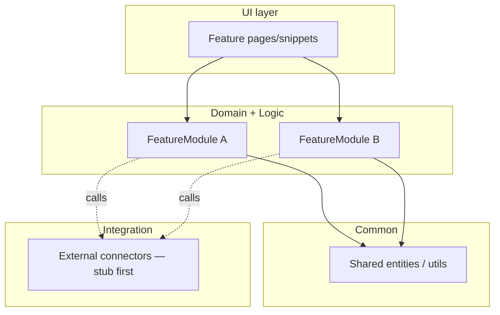
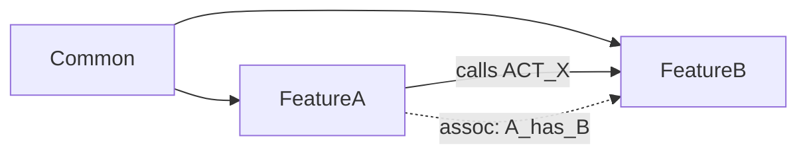
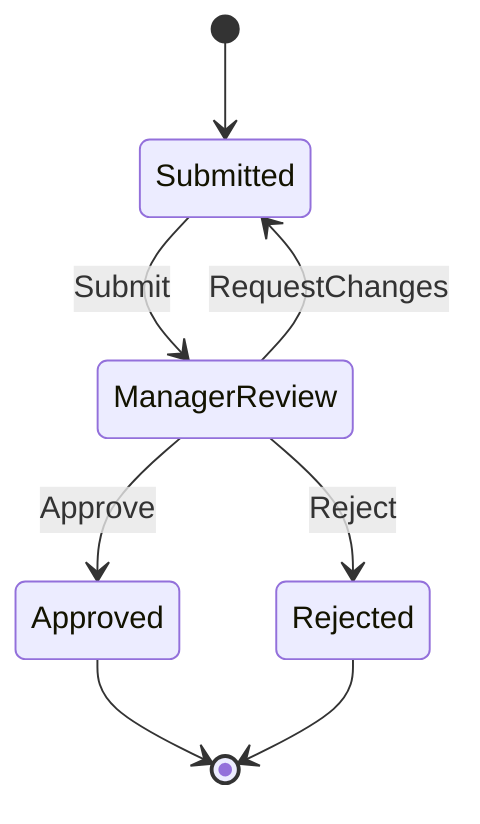
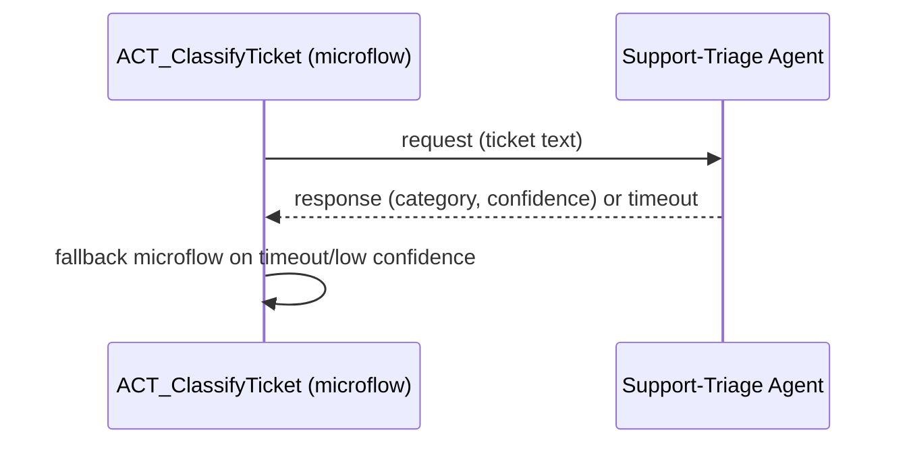

# Architecture Blueprint — Diagrams, Module Definitions, Wiring & Fit-Gap
**Applies to:** migration or requirements-driven build (works from documents/SME input — no legacy source needed).
**Requires:** bash and Python 3 — this skill runs toolkit shell scripts. Run `bin/doctor.sh` once on a new machine; it names anything missing and how to get it. Windows: use Git Bash, and see the Prerequisites section of `conversion-runbook.md`.
**Purpose:** Turn Mendix-rearchitected BRDs into a readable target-architecture blueprint — module definition docs, an architecture diagram, a wiring/dependency graph, and a fit-gap analysis — so dependencies and open gaps are visible *before* the build plan, not discovered mid-build.
**Upstream:** `migration-pipeline.md` Phase 6 (produces `.mx-brd.json` — the module boundaries this skill documents)
**Downstream:** `brd-to-build-plan.md` (consumes the dependency graph as build order, the fit-gap as scope boundary, and the open-issues register as the questions the plan must answer before script 01)
**Companion:** `design-artifacts.md` (the UI/brand half of the same architecture phase — run in parallel)

---

## When to Use This Skill

- You have `.mx-brd.json` files (Mendix module boundaries decided) and need to *communicate and pressure-test* the architecture before scripting.
- Someone asked for "the architecture diagram," "module design docs," a "wiring diagram," or a "fit-gap analysis."
- You keep hitting dependency surprises or "is this a gap or a deferral?" confusion mid-build.

If module boundaries aren't decided yet, that's `migration-pipeline.md` Phase 6 — specifically `modularize-domain.md`, which decides boundaries on their own merits (never 1:1 from source structure) and gets user sign-off. This skill assumes they are decided, and makes them legible + verifiable.

---

## Why This Step Exists

A `.mx-brd.json` set is a *machine* artifact. It says which module owns what. It does **not** show:
- how the modules stack (layers, who may import whom),
- the dependency graph that dictates build order,
- where the source's capabilities map cleanly to Mendix vs. need a workaround, a marketplace module, or a conscious behavior change,
- which open questions and known-bug handoffs will block a build if unanswered.

Skipping this step means those decisions get made ad hoc, mid-script. **The rule the whole toolkit enforces: if a gap or dependency would force rewriting an already-executed script, it must be surfaced here and carried into the build plan — never silently resolved.**

---

## Output of This Skill

Written to `architecture/` in the project workspace:

```
architecture/
  blueprint.md                 ← the index: tiers, the two diagrams, links to module docs
  blueprint.html               ← generated checkpoint render of blueprint.md (Step 7) — never hand-edited
  modules/
    <ModuleName>.md            ← one module definition doc per Mendix module
  fit-gap.md                   ← source capability → Mendix approach → build/buy/config/gap
  open-issues.md               ← consolidated dependency + gap + handoff register
```

Diagrams live **inside** the markdown as Mermaid (git-diffable, no browser needed) — **the markdown is the source of truth.** `blueprint.html` is a *generated render* of it, produced at Step 7 as the Stage-3 checkpoint surface (the runbook's `✋` gate is reviewed by a person, and the design track already arrives at that gate as HTML — the architecture track must too). Regenerate it whenever the markdown changes; never edit it directly.

---

## Step 1: Write One Module Definition Doc per Module

`architecture/modules/<ModuleName>.md`. Keep it to what's decidable now:

```markdown
# Module: <Name>
**Layer:** Common | Domain+Logic | UI | Integration
**Responsibility:** one sentence — what this module is accountable for.

## Entities
| Entity | Persistent? | Key attributes | Notes |

## Key microflows
| Microflow | Kind (GET_/VAL_/ACT_/SUB_/IVK_) | Purpose |

## Pages / snippets
| Page | Type (Overview/NewEdit/View/Popup/Snippet) | Source screen |

## Security
Module roles + which user role(s) map to them.

## Dependencies
- **Imports (calls into):** <other modules + what it uses>
- **Exposes (called by):** <the microflows/entities other modules consume>
- **Cross-module associations:** <assoc + which side owns it> (created via `CREATE ASSOCIATION` in mxcli — BUG-02 fixed in v0.13.0)
```

The **Dependencies** block is the raw material for Step 3 — fill it precisely; "imports X" must name the actual microflow/entity, not just the module.

---

## Step 2: Draw the Architecture Diagram (layer view)

The tiers from `migration-pipeline.md` Phase 6, instantiated for this app. Shows *legal dependency direction* — Common never imports feature modules.

````markdown

```mermaid
flowchart TD
  subgraph UI[UI layer]
    U1[Feature pages/snippets]
  end
  subgraph DL[Domain + Logic]
    D1[FeatureModule A]
    D2[FeatureModule B]
  end
  subgraph CM[Common]
    C1[Shared entities / utils]
  end
  subgraph INT[Integration]
    I1[External connectors — stub first]
  end
  U1 --> D1 & D2
  D1 & D2 --> C1
  D1 & D2 -.calls.-> I1
```
````

Rule: arrows point *down* the tiers. An arrow pointing up (Common → feature) is an architecture bug — fix the boundary, don't draw it.

---

## Step 3: Draw the Wiring / Dependency Diagram (build-order view)

A directed module graph from the Step 1 Dependencies blocks. **This is the input to the build plan's dependency order.** Flag cross-module associations distinctly — they determine which module's script creates each association (ownership still matters even though BUG-02 is fixed).

````markdown

```mermaid
flowchart LR
  Common --> FeatureA
  Common --> FeatureB
  FeatureA -->|calls ACT_X| FeatureB
  FeatureA -. assoc: A_has_B .-> FeatureB
  %% dotted = cross-module association (mxcli CREATE ASSOCIATION — BUG-02 fixed v0.13.0)
```
````

From this graph, the build order falls out: a module with no incoming arrows builds first; anything only depended-upon-via-stub can be built later. Hand this ordering to `brd-to-build-plan.md` Step 1 verbatim.

---

## Step 3b: Workflow Diagram (state view) — conditional

**Only produced when `checkpoint-architecture.md` CAC-3 Q3's Workflow-scope answer is A** (real
human-task/approval/escalation shape, modeled as a native Mendix Workflow, not a checkpoint-created
speculative artifact). Never draw this before that answer is `CONFIRMED` — same rule as every other
architecture/design artifact (`conversion-runbook.md` §"Stages are sequential").

One Mermaid `stateDiagram-v2` per Workflow-shaped process: states are the Workflow's user/system
tasks, transitions are its `OUTCOMES`.

````markdown

```mermaid
stateDiagram-v2
  [*] --> Submitted
  Submitted --> ManagerReview : Submit
  ManagerReview --> Approved : Approve
  ManagerReview --> Rejected : Reject
  ManagerReview --> Submitted : RequestChanges
  Approved --> [*]
  Rejected --> [*]
```
````

Embed in `blueprint.md` alongside the layer/wiring diagrams — the markdown is the source of truth,
`blueprint.html` (Step 7) is the generated render, per the rule at the top of this file.

---

## Step 3c: Agent-Wiring Diagram — conditional

**Only produced when CAC-3 Q3's Agent-wiring answer is A** (a real, scoped call site — not just
"agent"/"AI"/"copilot" language in a user story). A Mermaid sequence or flow diagram showing the
calling module/microflow, the agent/LLM endpoint, and the response path, annotated with the
sync/async and timeout/fallback decision recorded at the checkpoint.

````markdown

```mermaid
sequenceDiagram
  participant MF as ACT_ClassifyTicket (microflow)
  participant Agent as Support-Triage Agent
  MF->>Agent: request (ticket text)
  Agent-->>MF: response (category, confidence) or timeout
  MF->>MF: fallback microflow on timeout/low confidence
```
````

Same source-of-truth/render rule as Step 3b. No toolkit skill currently documents building this
kind of integration (confirmed by search, 2026-08-21) — the diagram records the *decision*, it does
not imply a scripted pattern exists yet. See `module-brief.md`'s "Build skills to read first" for
how that gap is surfaced to the builder rather than silently assumed away.

---

## Step 4: Fit-Gap Analysis (`architecture/fit-gap.md`)

The build-vs-buy-vs-workaround decision, one row per source capability. **This is where marketplace review lives** — reviewing marketplace for modules that (partly) match scope is a fit-gap decision, not a separate phase.

| Source capability | Mendix approach | Verdict | Open issue? |
|---|---|---|---|
| e.g. CRUD grid | Data Grid 2 (native) | **Native** | — |
| e.g. role-based access | Built-in Administration module | **Config** | — |
| e.g. charts/dashboard | Charts (marketplace, Mendix-supported) | **Buy** — decide if needed | maybe |
| e.g. signed-quantity convention | Explicit enum + sign-deriving microflow | **Build (changed behavior)** | resolved decision |
| e.g. feature never built in source | new page over existing logic | **Build (new)** | design from BRD |

Verdict vocabulary: **Native** (ships with Mendix/Atlas) · **Config** (native, needs setup) · **Buy** (marketplace) · **Build** (we script it) · **Workaround** (mxcli limitation → Studio Pro or manual) · **Gap** (unresolved — goes to open-issues).

**Marketplace rule of thumb:** for a small CRUD app, import almost nothing — the Administration module and Atlas/Data Grid ship by default. Only "Buy" when a capability is real, reusable, and cheaper than building. Over-importing adds upgrade surface; note every "Buy" as a dependency in Step 5.

**Deciding "Buy" here is not the same as installing it.** The actual `mxcli marketplace search/install` step happens later, as `brd-to-build-plan.md` Step 0 — before any domain-model script, so the module's real entities/microflows exist for MDL scripts to reference and validate against. This step only produces the decision; don't stop partway and leave a confirmed "Buy" un-imported going into the build.

---

## Step 5: Dependencies & Open-Issues Register (`architecture/open-issues.md`)

Consolidate everything that must be *carried into the build plan*, not lost:

| # | Item | Type | Resolution / owner |
|---|---|---|---|
| 1 | Unresolved BRD `openQuestions` | Decision needed | who decides, by when |
| 2 | Cross-module associations | Scripted via mxcli (BUG-02 fixed v0.13.0) | which module's script creates each, scheduled in which build step |
| 3 | Marketplace "Buy" decisions | Dependency | confirmed / deferred |
| 4 | mxcli known bugs on this app's shape | Handoff | see `bug-logs/mxcli-bugs.md` |
| 5 | Behavior changes vs. source | Faithful-rebuild risk | documented + signed off |

**Every unresolved BRD `openQuestion` must appear here.** Do not resolve them silently to make the diagram tidy — an open question in a diagram is honest; a wrong assumption baked into MDL is expensive.

---

## Step 6: The Three Decisions the Source Can't Answer ✋

These are genuine decisions, not derivable from the BRD or the source — run the full interview protocol (`conversion-runbook.md` §1) for each, and record every answer in `PROJECT.md`. This is a `✋` gate: `CONFIRMED` only, no `ASSUMED` past it.

### 6a. Target Security / Role Model

The source's auth model (if any) tells you what existed, not what the target should be. Ask explicitly:
- Does the source's role list map cleanly onto Mendix user roles, or does it need collapsing/splitting (same over/under-split judgment as module boundaries)?
- Anonymous/guest access: needed at all, and if so, for which entities/pages?
- Any regulatory or PII segregation requirement that should become a security-driven module boundary (feeds back into `modularize-domain.md` Step 2, criterion 4, if this wasn't already decided there)?

### 6b. Data Volumes, Concurrency, NFRs

Not asked anywhere else in the pipeline, and they decide concrete build choices: indexing, pagination, `DATAGRID` vs. paged `GALLERY`, loop batch sizes in microflows. Ask:
- Expected row counts per major entity (order-of-magnitude is enough — "dozens," "tens of thousands," "millions").
- Expected concurrent users / peak load.
- Any hard response-time or availability requirement.

### 6c. Integration Contracts

For every integration point the fit-gap flagged (Step 4) as needing a live connection:
- Real endpoint or stub for this build?
- Credentials/auth mechanism, and who owns provisioning them?
- Which environment is the test target (source's own sandbox, a mock, production-adjacent)?

Record each as a row in `architecture/open-issues.md` (Step 5's register) with its `CONFIRMED`/`ASSUMED` status, not as a separate untracked list — it's a dependency like any other.

---

## Step 7: Render the Checkpoint Surface (`architecture/blueprint.html`)

The Stage-3 `✋` gate is reviewed by a person, and raw Mermaid in markdown is a poor review surface. Generate `architecture/blueprint.html` from the markdown so the architecture track arrives at the checkpoint the same way the design track does (`design-system.html`, `wireframes/*.html`) — one system, one look.

- **Style:** copy the `:root` token block + base styles from the shared CSS shell (`toolkit-guide.html`; once `design/ds.css` exists, its tokens supersede — same rule as every stage surface).
- **Banner at the top:** `Generated from blueprint.md — do not edit; regenerate after changing the markdown.` Include the generation date.
- **Content:** the layer + wiring diagrams, **the workflow diagram (Step 3b) and/or agent-wiring diagram (Step 3c) when either was produced** — omit the section entirely when CAC-3 didn't call for it, never render an empty placeholder — a module summary table (linking `modules/<Name>.md`), the fit-gap table, and the open-issues register. It renders what the markdown says; it introduces nothing new.
- **Mermaid:** embed each diagram's source in `<pre class="mermaid">` with mermaid.js; if the review must work fully offline, pre-render to inline SVG (`npx @mermaid-js/mermaid-cli`) instead. Either way the markdown's Mermaid stays canonical.
- **Freshness is gated:** `bin/gate-check.sh` Stage 3 fails if `blueprint.html` is missing or older than `blueprint.md` / `fit-gap.md` / `open-issues.md`. Regenerating is cheap; a stale render at a sign-off gate is a lie.
- **Present it:** open `blueprint.html` in the user's browser when running the Stage-3 gate, alongside `module-design.html` and the design surfaces.

---

## Step 7b: Architecture Review Loop (iterative sign-off before Stage 4)

**Purpose:** `blueprint.html` from Step 7 is a one-shot render. This step turns it into an iterative review surface — the same loop as `module-review.md`'s LOOK stage but for architecture decisions, not rendered pages. The goal: every structural decision (module boundaries, entity relationships, normalization, marketplace choices, single vs multi-app) is explicitly confirmed by the user before the build plan is written. Surprises discovered here are cheap; the same surprise mid-build costs a rewrite.

**Diagnostic-only rule:** never update `blueprint.md`, BRDs, or module docs during a review pass. Findings only. Fixes are a separate approved step — same discipline as `module-review.md`.

---

### What the review covers

#### A. Single-app vs multi-app
- Is the scope right for one Mendix app, or should any module become a separate app connected via OData/REST?
- Flag if any module boundary crossed the threshold: different release cadence, different team, significantly different NFRs, or a natural API surface.
- Record the decision in `PROJECT.md` as `CONFIRMED` — this cannot be an `ASSUMED` past this gate.

#### B. Module structure
For each module in the layer diagram:
- Is its responsibility single and clear, or does it do two things that could drift apart?
- Are the dependency arrows all pointing *down* the tiers? Any upward arrow = boundary bug.
- Does the module size feel right — too much (should split) or too thin (should merge)?

#### C. Domain model per module
This is the highest-value review target — missed associations are the leading cause of build rework.

For each module, the HTML must show an **entity diagram**: boxes per entity, labeled association lines with cardinality (`1`, `*`, `0..1`), and a normalization decision badge on each entity (`Entity` / `Attribute` / `Enum` — why this and not the other).

**Review checklist per module:**
- Every concept from the BRD that involves a relationship has an explicit association line — not just an attribute storing a foreign ID.
- Every association has a cardinality label. Unlabeled = unreviewed = build risk.
- Every normalization decision is documented: why is `Status` an enum and not a string? Why is `Address` an entity and not attributes on `Customer`?
- No many-to-many associations without a named junction entity (Mendix handles these via a helper entity — it should be explicit, not generated silently).
- Cross-module associations are flagged distinctly — they determine which module's script owns the `CREATE ASSOCIATION` call.

#### D. Marketplace & fit-gap
- For every "Buy" row in fit-gap: is this the right module, and is the dependency justified? Over-importing is a real cost (upgrade surface, version lock).
- For every "Gap": is it genuinely deferred, or should it be resolved before Stage 4?
- Any "Workaround" row: is the workaround acceptable, or does it need a design change?

---

### The loop

```
generate blueprint.html (Step 7)
    ↓
open in browser — user reviews all four sections above
    ↓
user gives feedback (annotated screenshot, chat, or written notes)
    ↓
agent updates blueprint.md + module docs (diagnostic findings → approved changes)
    ↓
regenerate blueprint.html
    ↓
repeat until user explicitly signs off
    ↓
✋ CONFIRMED gate — record in PROJECT.md before Stage 4 starts
```

**Iteration budget:** aim for 2–3 rounds maximum. If still unresolved after 3 rounds, escalate the specific open question to a `PROJECT.md` decision row and continue — don't loop indefinitely on one ambiguity.

---

### Entity diagram HTML spec

Each module gets a section in `blueprint.html` with a self-contained entity diagram:

- **Entity boxes:** module-colored background, entity name in bold, key attributes listed (type shown), normalization badge bottom-right (`Entity` / `Enum` / `Attr`).
- **Association lines:** SVG arrows between boxes, labeled with association name + cardinality on both ends. Cross-module associations use a dashed line.
- **Junction entities** for many-to-many: rendered as a smaller diamond-shaped box between the two entities.
- **No external libraries required:** pure HTML/CSS/SVG so it renders offline and embeds cleanly as base64 if needed.
- **Justification callouts:** every structural decision gets a one-line *why* shown as a small muted callout next to the element. Keep it to one line — the goal is reviewability, not documentation. Cite the source (BRD section, sample data observation, or open question resolution). Examples:
  - Entity: `"Persistent — lifecycle + referenced by 3 modules (BRD F002 §3.2)"`
  - Association: `"1→* — avg 4.2 orders/customer in sample data"`
  - Normalization: `"Enum fixed 5 values, no own attributes (BRD F003 §2.1)"`
  - Module boundary: `"Separate from Core — different release cadence (OQ-3 CONFIRMED)"`
  - Marketplace: `"Buy Charts — 3 dashboard screens, build cost > buy cost"`
  - Cross-module assoc: `"Owned by OrderModule — Order is the master side"`

  If no justification exists for a decision, render the callout as `"⚠ no justification"` — that gap is itself a review finding.

The entity diagram is generated from the module `.md` files' **Entities** table — it introduces nothing new, it just makes the relationships and their rationale visible. If an entity's associations aren't in the module doc, they aren't in the diagram, and the gap is immediately visible during review.

---

### Feedback format

When the user gives feedback, capture it as a numbered finding list before making any change:

| # | Section | Finding | Severity | Resolution |
|---|---------|---------|----------|------------|
| 1 | Domain / OrderModule | `Order → OrderLine` association missing — only `OrderLineCount` attribute present | **P1** — build risk | Add association + cardinality |
| 2 | Fit-gap | Charts "Buy" decision not justified — only one KPI tile needed, build it | **P2** | Change to "Build" |
| 3 | Module boundary | `NotificationService` too thin — merge into `Common` | **P3** | Discuss before merging |

P1 = build risk (must resolve before Stage 4) · P2 = significant concern · P3 = polish / discuss.

Present the finding list and ask which to action before touching any file.

---

### Sign-off gate

Before proceeding to Stage 4 (`brd-to-build-plan.md`):

- [ ] Single vs multi-app decision recorded as `CONFIRMED` in `PROJECT.md`
- [ ] All module boundaries confirmed — no unresolved boundary bugs
- [ ] Every entity in every module has its associations explicitly drawn and cardinality labeled
- [ ] Every normalization decision documented (Entity / Attribute / Enum + reason)
- [ ] All many-to-many junctions named and explicit
- [ ] All cross-module associations ownership assigned
- [ ] Fit-gap "Buy" decisions confirmed or revised
- [ ] All P1 findings resolved; P2/P3 dispositioned (fix or consciously deferred)
- [ ] `blueprint.html` regenerated after last change and confirmed fresh by `gate-check.sh`

`bin/gate-check.sh <project-root> 3` enforces the last point mechanically (it fails when
`blueprint.html` is older than `blueprint.md`, `fit-gap.md` or `open-issues.md`). The rest are human sign-off — the agent presents the checklist, the user confirms each item, and the `CONFIRMED` row goes into `PROJECT.md`.

---

## Handoff to the Build Plan

`brd-to-build-plan.md` consumes this blueprint directly:
- **Step 4 fit-gap's confirmed "Buy" rows → imported before scripting starts** (its Step 0).
- **Step 3 wiring graph → build order** (its Step 1).
- **Step 4 fit-gap → scope boundary** (its Step 4: in-scope-real / in-scope-stubbed / out-of-scope).
- **Step 5 open-issues → the questions answered before script 01** (its Step 2).

If the build plan can't answer one of its Step 2 questions, the gap is in *this* blueprint — fix it here, then continue. Don't patch it in a script comment.

---

## Anti-Patterns This Skill Prevents

- **A module list mistaken for an architecture.** Boundaries without a dependency graph give no build order and hide cross-module coupling.
- **Silently resolving open questions to make a diagram look finished.** The diagram then lies; the build inherits the wrong assumption.
- **Discovering marketplace/build-vs-buy mid-build.** It's a fit-gap decision — make it here, with the capability in front of you.
- **Deciding "Buy" here but installing it late.** A confirmed "Buy" that's still un-imported when scripting starts causes the same mid-build rework as never deciding at all — install it at `brd-to-build-plan.md` Step 0, not whenever a script first needs it.
- **Drawing an up-the-tiers dependency.** Common importing a feature module is a boundary bug; the diagram should make it impossible to miss.
- **Diagrams as throwaway images.** Keep them as Mermaid in git so they diff and stay true; `blueprint.html` (Step 7) is the presentation render, regenerated from the markdown.
- **Hand-editing `blueprint.html`.** The render silently forks from the markdown and the checkpoint reviews a fiction. Fix the markdown, regenerate. (Same failure mode as editing generated BRDs.)
- **Skipping the entity diagram review.** Missing associations are the leading cause of MDL rework. A module doc with an entities table but no association lines reviewed is not architecture — it's a list. The diagram makes gaps visible; skipping it hides them until a script fails.
- **Treating the first blueprint.html as the sign-off surface.** The loop exists because the first render always has gaps. One round is not a review; it's a draft. Sign-off requires an explicit confirmed checklist, not "looks good."
